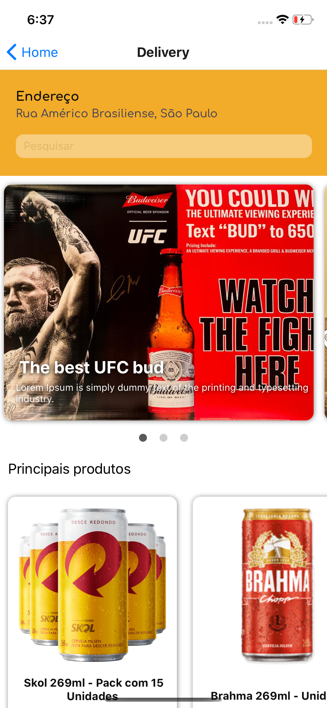

# Delivery Sample
<p align="center">React Native + GraphQL application<p>
  
 <p align="center">
  
  
  
</p>
  
<p align="center">A responsive sample app that uses GraphQL query and native resources.<p>
  
  ## Running the project 
  This react-native project was based on *iOS* system and *Yarn* dependency management.

  <b>Running in a macOS system</b>
  After cloning this repo, open the terminal
  Run:
  
    brew update
    brew upgrade
    brew install node
    brew install watchman
    
  At root's application:
  
  Get the dependecies
  
    yarn
    
  Running in a device simulator
    
    yarn run ios
    
  Or
  
    yarn run android
    
   - Issues while building the app?
    - Verify pods at ios folder
    - Verify path variables (ANDROID_HOME, JAVA_HOME) for running in a android enviroment
  
  ## Some observations
  
  - Calling APIs: Timeout request with Google maps API; Can't setState in *coordinates* varaible. The hook should return
    ```
    {
      address: addressInput, // variable with use input
      lat: (value.geometry.location.lat).toString(), // coord. from API
      lng: (value.geometry.location.lng).toString(),
      time: (new Date()).toString() // user's date time
    }
    ```
      - Causes: API Key expired
      
  - Products screen issues with GraphQL query
    - Use mocks to call the API that returns the ID from user address;
    - Issues with useEffect hook: The first render for some reason don't set the variable productsList in the right way while react lifecycle. The user needs to re-render the screen to se the cards with the products.
    - *FlatList* renders just the first 5 itens
      - Needs to implement a 'see more' button to show other itens
      
   ## Future implementations for this project
   
  - Implement optimized and correct way lifecycle hooks
  - Fix carousel card's render and automate it
  - If a image url is broken, set a deafult image for the product
  - Implement filter functionality
    - Create query the calls a response with products category
  - Implement validations at buttons, filters and query's request
  - Implement e2e testing and automatize tests
